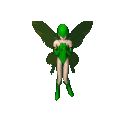

# Geniva — Desktop Fairy AI Companion

A floating desktop AI agent that lives on your screen as an animated fairy. She can read/write files, run commands, generate images, search the web, and learn from every task.



## Features

- **Three AI Brains** — Local (Ollama), Claude Code CLI, Claude API
- **14 Tools** — File operations, shell commands, ComfyUI image generation, web search, persistent memory
- **Adaptive Performance** — Auto-throttles GPU/CPU/RAM based on system load
- **VRAM Management** — Auto-evicts models when ComfyUI or other GPU apps need space
- **Active Learning** — Tracks task patterns, builds shortcuts, learns from errors
- **Persistent Memory** — Remembers things about you across sessions
- **Auto-Fallback** — If one brain fails, automatically tries another
- **Image Support** — Paste screenshots or drag-drop files into chat

## Requirements

- **Windows 10/11** (Electron desktop app)
- **Node.js 18+** — [Download](https://nodejs.org/)
- **NVIDIA GPU** recommended (for local model acceleration)
- **Ollama** — Required for local brain — [Download](https://ollama.com/)

## Quick Start

### 1. Clone and install

```bash
git clone https://github.com/amarkgo5/Geniva.git
cd Geniva
npm install
```

### 2. Install Ollama and set up the brain

Download and install Ollama from [ollama.com](https://ollama.com/), then:

```bash
# Pull the base model (~9GB download)
ollama pull qwen2.5:14b

# Create Geniva's brain from the included Modelfile
ollama create geniva-brain -f Modelfile

# (Optional) Pull the vision model for image analysis
ollama pull llava
```

### 3. Launch Geniva

```bash
npm start
```

A small fairy will appear on your desktop. Click her to open the chat bubble, or right-click for options.

## Brains

### Local Brain (default)
Runs entirely on your PC via Ollama. No internet needed. Requires ~5-10GB RAM and benefits from a GPU.

- Model: `geniva-brain` (qwen2.5 14B, Q4 quantized)
- Vision: `llava` (for image analysis)

### Claude Code Brain
Uses the Claude Code CLI tool. Requires [Claude Code](https://docs.anthropic.com/en/docs/claude-code) to be installed and authenticated.

```bash
npm install -g @anthropic-ai/claude-code
claude login
```

### Claude API Brain
Calls the Anthropic API directly. Requires an API key.

1. Get a key at [console.anthropic.com](https://console.anthropic.com/)
2. Open Geniva's panel (click "Open full app")
3. Go to Settings and paste your API key

## Performance Tuning

Geniva includes an adaptive performance monitor that automatically adjusts based on your system load. You can also manually tune these in the Settings panel:

| Setting | Default | Description |
|---------|---------|-------------|
| GPU Layers | 20 | How many model layers run on GPU. Lower = less lag, 0 = CPU only |
| Context Size | 4096 | Token context window |
| Max Output Tokens | 1024 | Max tokens per response |
| Batch Size | 256 | Lower = smoother GPU usage |

**If Geniva is lagging your PC:**
- Lower GPU Layers to 10-15 (or 0 for CPU-only mode)
- The adaptive monitor will also auto-throttle when it detects system pressure

## Optional: ComfyUI (Image Generation)

For image generation capabilities, install [ComfyUI](https://github.com/comfyanonymous/ComfyUI):

1. Install ComfyUI and an SDXL checkpoint
2. Start ComfyUI on port 8000 (default)
3. Geniva will auto-detect it and use it for image generation tasks

## File Structure

```
Geniva/
  main.js          # Core agent — brains, tools, performance monitor
  index.html       # Fairy bubble window
  panel.html       # Full panel UI (chat, activity, memory, settings)
  Modelfile        # Ollama model configuration
  package.json     # Node dependencies
  geniva-body.png  # Fairy sprite
  wing-left.png    # Wing animation frames
  wing-right.png
  geniva-fairy.png # Panel/icon sprite
  geniva-icon.png  # App icon
```

## Runtime Files (not in repo)

These are created automatically when Geniva runs:

- `memory.json` — Persistent key-value memory
- `history.json` — Task history (last 100 tasks)
- `learning.json` — Learning patterns and shortcuts
- `worklog.json` — Recent files/images created

## Debug API

Geniva runs a local HTTP server on port 3945:

```bash
# Send a task
curl -X POST http://127.0.0.1:3945/task -H "Content-Type: application/json" -d '{"message":"hello"}'

# Check status
curl http://127.0.0.1:3945/status

# View chat history
curl http://127.0.0.1:3945/chat

# Check performance metrics
curl http://127.0.0.1:3945/perf
```

## License

MIT
